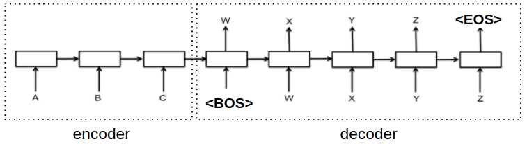

# Homework 5 - Sequence-to-sequence

Reference: https://colab.research.google.com/github/ga642381/ML2021-Spring/blob/main/HW05/HW05_ZH.ipynb#scrollTo=VtXNMnrfeFg0

若有任何問題，歡迎來信至助教信箱 [ntu-ml-2021spring-ta@googlegroups.com](mailto:ntu-ml-2021spring-ta@googlegroups.com)

## Sequence-to-Sequence 介紹

- 大多數常見的 seq2seq model 為 encoder-decoder model，主要由兩個部分組成，分別是 encoder 和 decoder，而這兩個部可以使用 recurrent neural network (RNN)或 transformer 來實作，主要是用來解決輸入和輸出的長度不一樣的情況
- **Encoder** 是將一連串的輸入，如文字、影片、聲音訊號等，編碼為單個向量，這單個向量可以想像為是整個輸入的抽象表示，包含了整個輸入的資訊
- **Decoder** 是將 encoder 輸出的單個向量逐步解碼，一次輸出一個結果，直到將最後目標輸出被產生出來為止，每次輸出會影響下一次的輸出，一般會在開頭加入 "< BOS >" 來表示開始解碼，會在結尾輸出 "< EOS >" 來表示輸出結束

## 作業介紹

- 英文翻譯中文
  - 輸入： 一句英文 （e.g. tom is a student .）
  - 輸出： 中文翻譯 （e.g. 湯姆 是 個 學生 。）
- TODO
  - 訓練一個 RNN 模型達到 Seq2seq 翻譯
  
  - 訓練一個 Transformer 大幅提升效能
  
  - 實作 Back-translation 大幅提升效能
  
    

## 資料集介紹

### 英轉繁雙語資料

- TED2020
  - 原始資料量: 398,066句
  - 處理後資料: 393,980句

### 測試資料

- 資料量: 4,000句
- **中文部分不公開，提供的檔案為假翻譯，全部都是句點。**

